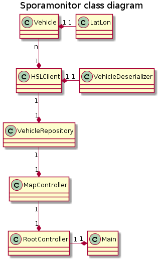

# Aiheen kuvaus ja rakenne

**Aihe**: Sovellus HSL:n raitiovaunujen näyttämiseen kartalla

Toteutetaan sovellus, jonka avulla voidaan seurata HSL:n raitiovaunujen liikennettä Helsingin seudulla.
Sovellus koostuu karttanäkymästä, joka näyttää raitiovaunujen sijainnit elementteinä kartalla päivittyen reaaliaikaisesti.

**Käyttäjät**: Henkilö, joka haluaa seurata raitiovaunujen liikennettä.

**Toiminnot**:

* Karttanäkymä, jonka
    * keskikoordinaatteja voidaan siirtää hiirtä raahaamalla
    * suurennustasoa voidaan muuttaa
ja jossa
    * raitiovaunujen reaaliaikainen sijainti näkyy graafisena elementtinä
    * raitiovaunujen reitit näkyvät linjoina kartalla
* Suodatinnäkymä, jossa käyttäjä voi
    * valita, mitkä HSL:n raitiovaunureitit näkyvät kartalla

## Luokkakaavio

Sovelluksen rakenne muodostuu kahdesta osasta: HSL:n Live-palvelun rajapintakirjastosta sekä itse bisneslogiikasta, joka on rakennettu Model-View-Controller (MVC) - arkkitehtuurin mukaisesti. Sovelluksen mallitasolla sijaitseva `VehicleRepository` kutsuu rajapintaa `HSLClient`-luokan kautta säännöllisin väliajoin ja ilmoittaa kuuntelijoillensa tilan muuttuneen. Käsittelijätasolla sovellus luo käynnistyessään RootController-olion, joka puolestaan luo malliolion sekä karttakäsittelijän (`MapController`). Karttakäsittelijä ottaa parametreinaan malliolion ja asettaa itsensä kuuntelemaan sovelluksen tilan muutoksia piirtäen kartan uudelleen raitiovaunujen sijaintien päivittyessä. Käsittelijäoliot hallinnoivat näkymäolioita, jotka on toteutettu AWT:llä ja Mapsforge-karttakirjastolla.
